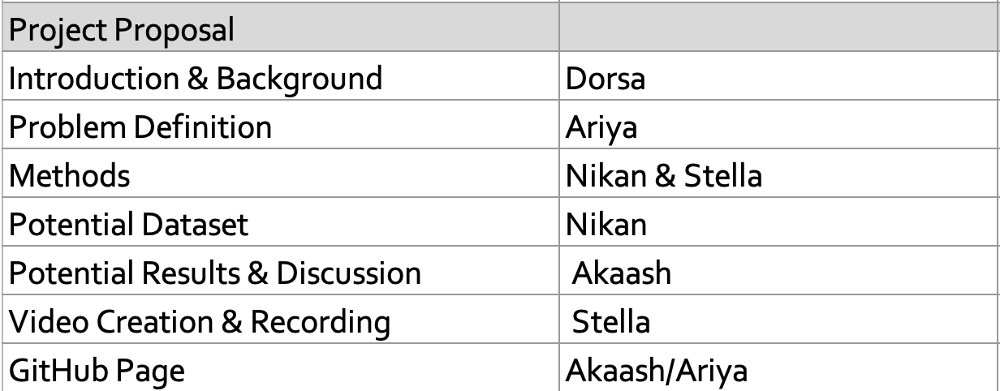
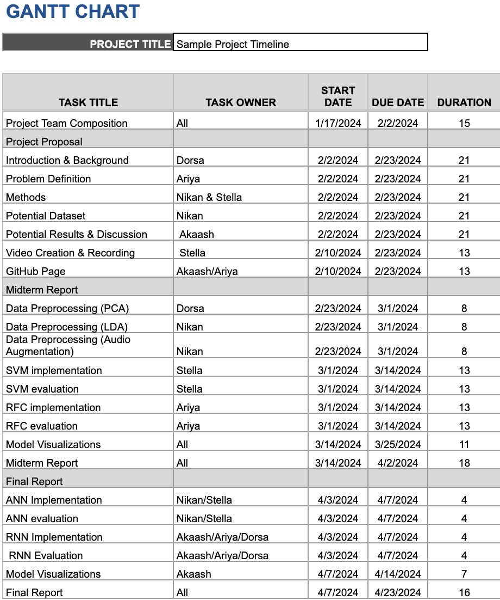

# Music Genre Categorization

## Team
Dorsa Ajami - dajami3@gatech.edu  
Ariya Foroshani - aforoshani3@gatech.edu  
Stella Hansen - ehansen35@gatech.edu  
Nikan Hassanipak - nhassanipak3@gatech.edu  
Akaash Dash - adash37@gatech.edu

**Mentor:** Mohammad Taher - mtaher3@gatech.edu

## Introduction/Background
Our project will cover genre classification in the music industry, based on the features extracted from the audio files of songs with explicit genre labels. The [GTZAN dataset](https://www.kaggle.com/datasets/andradaolteanu/gtzan-dataset-music-genre-classification) contains the following for each song in the 1000-song dataset of 10 genres:
- Raw audio files (.wav) 
- Mel-Spectrogram representations 
- .csv containing features extracted from the audio files, and the song's genre label (58 features per song).

Research for genre classification in the music industry has seen many major publications, with one approach highlighting the importance of combining preprocessing techniques and feature extraction (e.g. normalization, MFCCs, UWT, and LPCCs) with various traditional ML algorithms (KNN, SVM, ANN) [1]. More recent research emphasizes the transition from traditional feature engineering towards end-to-end learning models, along with the need for models that can be generalized across a variety of musical pieces, thereby introducing deep learning approaches such as CNN and RNN [2,3]. 

## Problem Definition
Manual tagging of songs by genre is flawed, but a new tagging system that uses machine learning to classify the genre of songs could address the following shortcomings: 
- Scalability/efficiency: Automating genre classification would save music distribution companies time and resources.
- Consistency and objectivity: Humans are prone to bias, whereas machine learning would apply consistent criteria to all songs. 
- Genre equality: Machine learning models can impartially identify emerging genres, giving equal visibility to upcoming artists not fitting traditional genres. 
- Discovery/Recommendations: More accurate categorization of music enhances music recommendation systems.

## Methods
Data Preprocessing Methods:
- PCA: To mitigate the risk of overfitting (due to 58 features), we will produce a reduced-dimension version of the data.
- LDA: Provides an alternative dimensionality reduction method that is suited for maximizing class separation.
- Audio augmentation: By applying pitch/tempo shifting, we can generate augmented versions of the songs for the ML models, improving performance on unseen data.

## ML Algorithms/Models
- SVM: Popular for audio classification tasks, particularly due to its performance in high-dimensions.
- RFC: Provides the benefits for classification tasks that decision trees offer, whilst minimizing overfitting.
- Logistic regression: Useful for songs that mix genres (assigns probability of belonging to a specific genre).
- RNN: Cited in the literature as being at the forefront of audio classification tasks (especially when features are extracted from the audio file).

## Results and Discussion
With our project being based around classification problem with 10 classes, the following metrics will be used (with the goal values):
- Overall accuracy/Cross-validation accuracy (> 70%)
- Precision (> 0.7) (Per-class/averaged)
- Recall (> 0.7)  (Per-class/averaged)
- F1 Score (> 0.7)  (Per-class/averaged)

While we hope that we can achieve 70% and above in these metrics (which are cited as good metric levels for 10 classes), we expect that some classes will have lower metric levels (particularly similar genres that will get misidentified for one another, i.e. pop and hip-hop). This is why we will also use the 10x10 confusion matrix to detect these specific misidentifications.

## Contributions

## Gantt Chart

## References
[1] M. Chaudhury, A. Karami, and M. A. Ghazanfar, “Large-scale music genre analysis and classification using Machine Learning with apache spark,” Electronics, vol. 11, no. 16, p. 2567, Aug. 2022. doi:10.3390/electronics11162567 

[2] J. Nam, K. Choi, J. Lee, S.-Y. Chou, and Y.-H. Yang, “Deep learning for audio-based music classification and tagging: Teaching computers to distinguish rock from Bach,” IEEE Signal Processing Magazine, vol. 36, no. 1, pp. 41–51, Dec. 2018. doi:10.1109/msp.2018.2874383 

[3] H. Purwins et al., “Deep Learning for Audio Signal Processing,” IEEE Journal of Selected Topics in Signal Processing, vol. 13, no. 2, pp. 206–219, May 2019. doi:10.1109/jstsp.2019.2908700 

