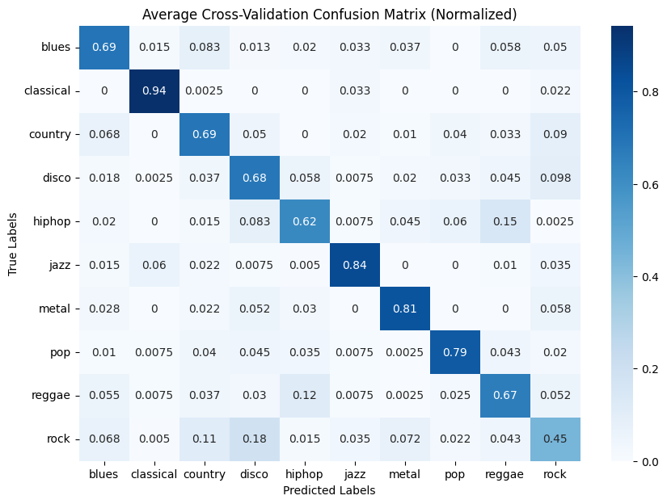
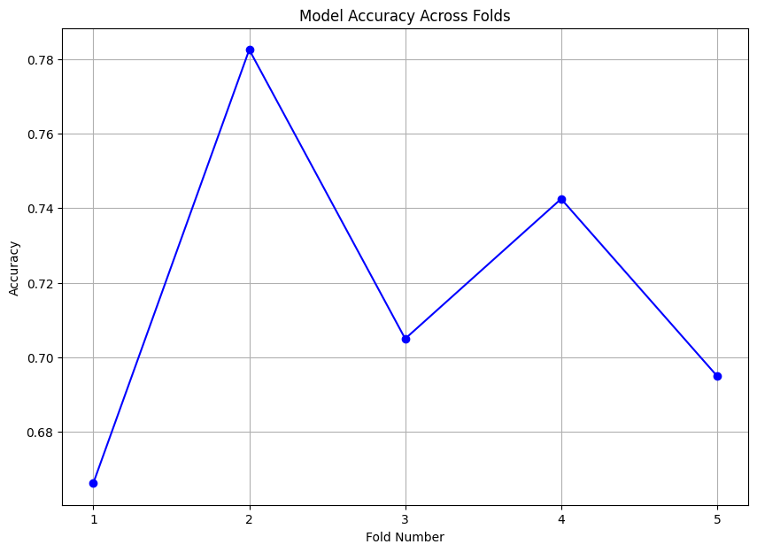
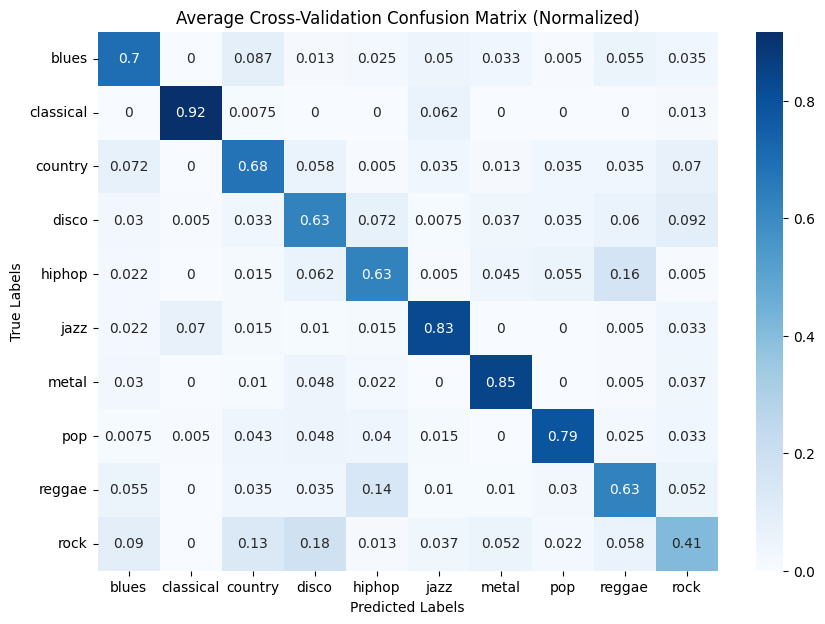
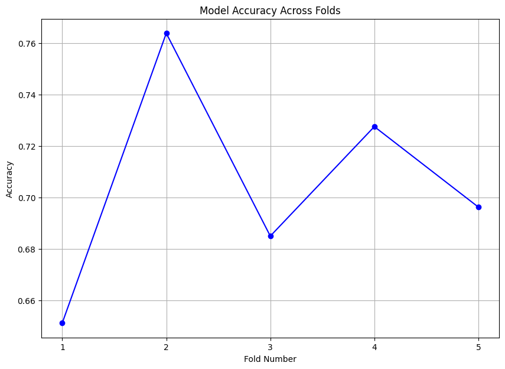
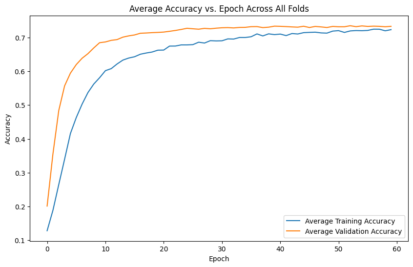
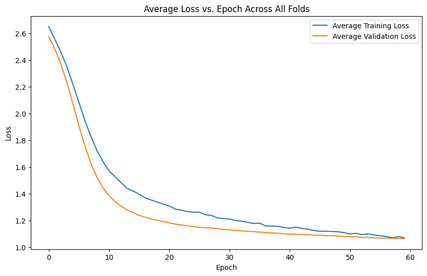
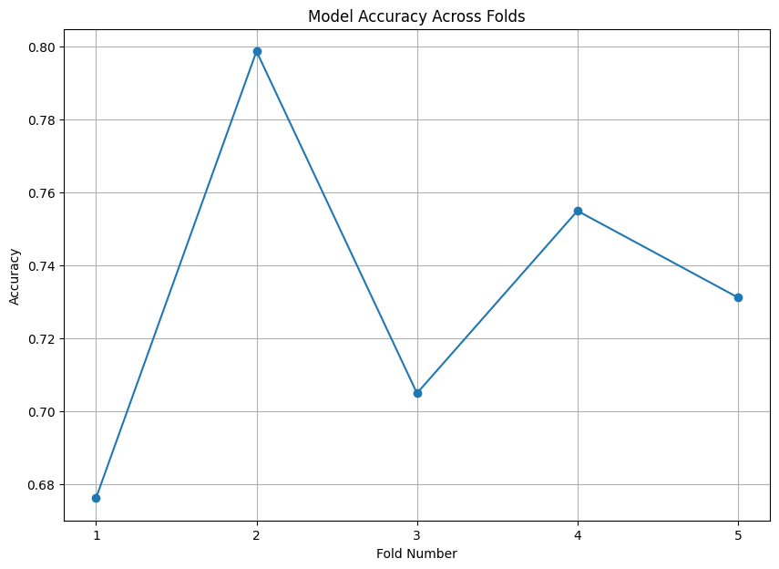
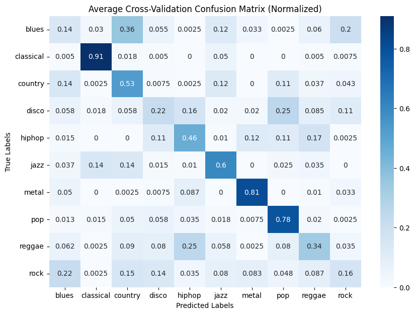
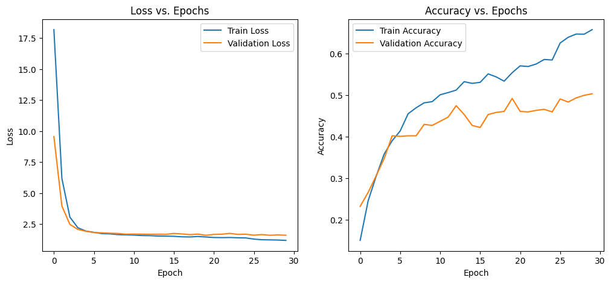
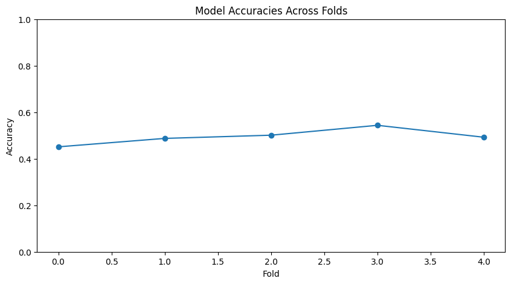

# Music Genre Categorization

## Team
Dorsa Ajami - dajami3@gatech.edu  
Ariya Foroshani - aforoshani3@gatech.edu  
Stella Hansen - ehansen35@gatech.edu  
Nikan Hassanipak - nhassanipak3@gatech.edu  
Akaash Dash - adash37@gatech.edu

**Mentor:** Mohammad Taher - mtaher3@gatech.edu

## Introduction/Background
Our project will cover genre classification in the music industry, based on the features extracted from the audio files of songs with explicit genre labels. The [GTZAN dataset](https://www.kaggle.com/datasets/andradaolteanu/gtzan-dataset-music-genre-classification) contains the following for each song in the 1000-song dataset of 10 genres:
- Raw audio files (.wav) 
- Mel-Spectrogram representations 
- .csv containing features extracted from the audio files, and the song's genre label (57 features per song).

Research for genre classification in the music industry has seen many major publications, with one approach highlighting the importance of combining preprocessing techniques and feature extraction (e.g. normalization, MFCCs, UWT, and LPCCs) with various traditional ML algorithms (KNN, SVM, ANN) [1]. More recent research emphasizes the transition from traditional feature engineering towards end-to-end learning models, along with the need for models that can be generalized across a variety of musical pieces, thereby introducing deep learning approaches such as CNN and RNN [2,3].

## Problem Definition
Manual tagging of songs by genre is flawed, but a new tagging system that uses machine learning to classify the genre of songs could address the following shortcomings:
- **Scalability/efficiency:** Automating genre classification would save music distribution companies time and resources.
- **Consistency and objectivity:** Humans are prone to bias, whereas machine learning would apply consistent criteria to all songs. 
- **Genre equality:** Machine learning models can impartially identify emerging genres, giving equal visibility to upcoming artists not fitting traditional genres. 
- **Discovery/Recommendations:** More accurate categorization of music enhances music recommendation systems.

## Methods
### Data Preprocessing Methods:
- PCA: To mitigate the risk of overfitting (due to 57 features), we will produce a reduced-dimension version of the data.
- LDA: Provides an alternative dimensionality reduction method that is suited for maximizing class separation.
- Audio augmentation: By applying pitch/tempo shifting, we can generate augmented versions of the songs for the ML models, improving performance on unseen data.
- Sequential data extraction for RNN: Extract features at a specified sample rate to create a sequential dataset suitable for RNN input.

### ML Algorithms/Models:
- SVM: Popular for audio classification tasks, particularly due to its performance in high-dimensions.
- RFC: Provides the benefits for classification tasks that decision trees offer, whilst minimizing overfitting.
- ANN: Deep learning architecture allows for the non-linear relationships between audio features and genres to be captured. Would also indicate if more complex deep learning models (CNN/RNN) are feasible for this problem and dataset.
- RNN: Cited in the literature as being at the forefront of audio classification tasks, especially when features are extracted from the audio file.

\* Note that during the midterm report we decided to pivot from a logistic regression model to an ANN model due to the fact that we already proved that non-deep learning methods (SVM/RFC) can learn our data and complete the classification task to a high and satisfactory accuracy. We would therefore like to pursue more deep learning approaches that can capture the complexity of our audio features to a higher degree.

### Preprocessing Method 1: Audio Augmentation

The initial preprocessing method that we will be applying to our data is audio augmentation, which is a beneficial technique frequently used in tasks such as speech recognition, sound classification, and music analysis. The goal of audio augmentation is essentially to apply different augmentations to the original versions of the songs, such that we generate more data points for our models to be trained on. We implemented this method through the augment_audio function (found in "Audio Augmentation.ipynb") which takes in the time series of the original song, and returns three augmented versions of the song: one with random noise added on top, one with a time stretch, and one with a pitch shift. When we called this function, we used the parameters noise_factor=0.005 (minimal random noise is added), stretch_factor=0.8 (sped up version is returned), and n_steps=-1 (lower pitched version is returned). Since we only have 1,000 original songs, this preprocessing technique helps improve our models’ performances to unseen data (due to the fact that we now have 4,000 total data points, and the minor differences applied to generate the new data points will help improve classification within the validation set whilst also reducing the risk of overfitting to the training set, since the models are exposed to a wider array of data points).

It should be noted that this audio augmentation method will require us to be very careful when performing our train-test split for our model evaluations to ensure that no data leakage occurs. If two versions of the same song are allowed to be assigned to different sides of the train-test split, the models will have falsely accurate performances, since they will recognize that the training set has a very similar song to the one being evaluated within the testing set. This is why within our code, we use the songs’ predetermined title formatting to our advantage. Each genre has 100 songs, labeled in the format genre.song_number.wav, where song_number is a 5 digit value ranging from 00000 to 00099. We can therefore perform a manual five fold cross-validation, in which the song_numbers act as the index of the train-test split. So for fold one, songs with numbers from 00000 to 00019 will be used as the validation set, whilst songs with numbers from 00020 to 00099 are used as the training set. Not only does this ensure that all four versions of a song remain on the same side of the train-test split for any given fold, but it also implements stratification by making it such that each validation set uses the same number of songs from each genre as its support (ensuring that the evaluation metrics provide a more conclusive and accurate picture of the true performance of the model).

### Preprocessing Method 2: Principal Component Analysis (PCA)

The first dimensionality reduction technique used was PCA. PCA is an unsupervised method that does not use class labels and identifies the principal components of the dataset that capture the maximum variance. This process involves shifting the data onto a new z-space and selecting the top principal components that preserve the largest amount of the variance from the dataset. In our case, PCA was useful given the high dimensionality of our dataset, namely 57 features per sample, as it allowed us to reduce the risk of overfitting our model and reduces the complexity.  

To implement PCA on our data, we used the ‘PCA’ module from the ‘sklearn.decomposition’ package. We wanted to capture a large portion of the variance while still reducing the number of features, and therefore we chose to maintain 95% of the variance of the original dataset which translated to 34 principal components. Note that PCA assumes the directions with the largest variances in our z-space are most informative, which does not necessarily accomplish the best results when the objective is distinguishing between different music genres. This is an area where supervised learning algorithms such as LDA are better for maximizing class separability which is what we see when comparing their results for both SVM and RFC.

### Preprocessing Method 3: Linear Discriminant Analysis (LDA)

While PCA is a very useful dimensionality reduction technique, we wanted to take advantage of the labeled nature of our data during the pre-processing, which is why we also used Linear Discriminant Analysis (LDA) as an alternative dimensionality reduction technique. Unlike PCA, (no class labels required) which shifts the data onto a new z-space that maximizes the amount of variance captured (which may potentially aid in classification tasks by spreading the data out), LDA (class labels required) explicitly optimizes the class separation by shifting the data onto a new z-space that maximizes the ratio of between-class and within-class variance, which subsequently makes the classes more linearly separable. In our case of genre classification, this essentially meant that we are able to reduce the dimensions of our data (and therefore the risk of overfitting) whilst ensuring that we still captured the essence of what separated one genre from another.

To apply LDA to our data, we used the ‘LinearDiscriminantAnalysis’ module from the ‘sklearn.discriminant_analysis package’. Unlike PCA, where the number of principal components generated was obtained by stating the proportion of variance we would like our new z-space to capture, LDA requires us to provide it with the number of linear discriminants. Since the maximum number of linear discriminants we can choose is n - 1, where n is the number of classes (in this case 10 genres), we chose to reduce our data to a maximum possible 9 linear discriminants. It should be noted that LDA makes three very significant assumptions about the nature of our data: features are normally distributed, features are statistically independent from one another, and the covariance matrix of our features is constant across classes (homoscedasticity). While it is rare that a data set conforms to all of these assumptions, LDA works very well in practice, as seen through the fact that both our SVM and RFC models achieved their highest accuracies when fed with the LDA formatted version of our data.

### Preprocessing Method 4: Sequential Data Extraction for RNN

While using the mean and standard deviation of different extracted audio features (zero-crossing rate, rms, spectral bandwidth, etc.) throughout the course of a song was sufficient for the SVM, RFC, and ANN models, the RNN requires our data to be in a sequential format. Due to this input constraint, we had to create a new dataset that extracted audio features from the .wav files at a specified sample rate. A conventional sample rate used for audio classification tasks is a hop length of 512 (equating to one sample every 43 milliseconds, which for our 30 second files would lead to 1290 sample instances per feature we decided to extract). In order to complete the data extraction in a reasonable amount of time with our computational resources, we could not create this sequential data set for all 57 features that were used in the other three models. Initially, we attempted to only extract one feature for each song sequentially: the time series value of the actual audio file’s waveform. Despite sampling this value 1290 times per song, the RNN model performed very poorly (around a 15% validation accuracy), thereby indicating that the value of the audio time series by itself does not sufficiently represent a song to the point in which its genre can be classified. This is why we then shifted to using three audio features that are measured in a series of bands/coefficients: MFCC (20 bands), chroma (12 bands), and spectral contrast (7 bands). This equated to sampling each of the 39 features (bands) 1290 times per song, which led to a very large dataset (3.7 GB) that took a long time (400 minutes) to extract with the computational resources we had available. Once we had this data format ready, we used one-dimensional CNN layers as a preprocessing method, since traditional dimensionality reduction techniques such as PCA and LDA are not as effective on sequential data.

### ML Algorithm/Model 1: Support Vector Machine (SVM)

The first classification algorithm that we decided to use is a Support Vector Machine (SVM), due to its many advantages:
1. SVM inherently finds the hyperplane that maximizes the margin between different classes, which is especially useful in music classification as some genres only have subtle differences separating them.
2. The kernel option provided by the SVM algorithm allows us to tune the model to best fit the characteristics of our data. Through alternating from the default linear kernel to more complicated options such as polynomial or radial basis function (RBF), we can shift our data to a transformed feature space without explicitly needing to compute the coordinates of the new space. Essentially, this allows us to capture non-linear relationships between our audio features, which was evident in our case as the RBF kernel yielded the highest cross-validation accuracy.
3. SVM is very well-suited to high-dimensional spaces. While we were able to reduce the number of dimensions down to 34 principal components with PCA and 9 linear discriminants with LDA, being able to use an algorithm that performs relatively well with all 57 original features is advantageous, as it would allow us to maintain some model interpretability (i.e. know which features are more important than others in genre classification).
4. While SVM is inherently a binary classifier, it can be used for multi-class classification tasks by using the one-vs-all or one-vs-one extension methods, which is required in our case since we have 10 classes.

### ML Algorithm/Model 2: Random Forest Classifier (RFC)

The second classification algorithm that we decided to use is Random Forest Classifier (RFC), due to its many advantages:
1. Because of the relatively simple structure of Random Forests (a collection of decision trees), it is easy to identify important audio features when it comes to genre classification. The decision tree layout actively quantifies how effective certain features are in the prediction process.
2. RFC is great at dealing with non-linear relationships because it is an ensemble method (RFC merges results from multiple decision trees). Due to the nature of audio data, we didn’t expect our features to be linear, so random forest was a clear choice. 
3. Again, because RFC is an ensemble method, it is far less likely to overfit the data as compared to a traditional decision tree algorithm. Since we are looking at the aggregation of several decision trees, it is much harder to overfit to the training data (a computed average is much more representative of a dataset than individual point).
4. If a RFC is able to learn your data and perform relatively well, it indicates that the data itself is learnable, and thereby encourages the pursuit of deep learning methods.

### ML Algorithm/Model 3: Artificial Neural Network (ANN)

The third classification algorithm that we decided to use is Artificial Neural Network (ANN), due to its many advantages:
1. ANNs can model non-linear relationships present in our musical data through their flexibility in the number of hidden layers and a number of different nonlinear activation functions (e.g. ReLU, Sigmoid) which is great for identifying and learning intricate non-linear patterns.
2. ANNs allow for a great deal of control to prevent overfitting through careful selection of the number of hidden layers, the depth of each hidden layer, the careful selection of dropout percentage at each hidden layer, L2 regularization, and early stoppage.
3. Deep Learning algorithms are a logical next step after traditional models such as SVM and RFC proved that our data was learnable as they can capture deeper abstractions in data.

### ML Algorithm/Model 4: Recurrent Neural Network (RNN)

The fourth classification algorithm that we decided to use is Recurrent Neural Network (RNN), due to its many advantages:
1. RNNs are designed to process sequential data, making them well-suited for audio classification tasks where temporal relationships between features are important.
2. By using LSTM units, RNNs can capture long-term dependencies in the audio features. The ability to handle variable-length input sequences allows RNNs to process audio files of different durations without requiring fixed-size inputs.
3. RNNs can learn hierarchical representations of the audio data by processing it sequentially, enabling them to capture complex patterns and relationships between features at different time scales.
4. The use of convolutional layers as a preprocessing step for the sequential data allows the model to learn local patterns and reduce the dimensionality of the input, improving computational efficiency and reducing overfitting [4].

## Results and Discussion
With our project being based around classification problem with 10 classes, the following metrics will be used (with the goal values):
- Overall accuracy/Cross-validation accuracy (> 70%)
- Precision (> 0.7) (Per-class/averaged)
- Recall (> 0.7)  (Per-class/averaged)
- F1 Score (> 0.7)  (Per-class/averaged)

While we hope that we can achieve 70% and above in these metrics (which are cited as good metric levels for 10 classes), we expect that some classes will have lower metric levels (particularly similar genres that will get misidentified for one another, i.e. pop and hip-hop). This is why we will also use the 10x10 confusion matrix to detect these specific misidentifications.

### Results

We first apply both non-deep learning models, SVM and RFC, across the three different data preprocessing types to see which would be most effective for our task. We find the following:

| <u>Avg. Accuracy</u> | Original (no dimension reduction) | PCA    | LDA    |
|-------------------|-----------------------------------|--------|--------|
| **SVM**               | 62.750%                            | 61.050% | <u>71.825%</u> |
| **RFC**               | 59.050%                           | 57.950% | <u>70.475%</u> |

*<u>Table 1</u>: Average accuracy across models / pre-processing techniques*

We observe that the two highest performing models were SVM with LDA and RFC with LDA. We then look at the accuracy reports and confusion matrices for these two models.

### Results Algorithm/Model 1: SVM with LDA

| <u>Genre</u>  | <u>Precision</u> | <u>Recall</u> | <u>F1-Score</u> |
|------------|-----------|--------|----------|
| **Blues**  | 70.973%   | 69.250%| 69.784%  |
| **Classical** | 91.973% | 94.250%| 92.560%  |
| **Country**| 64.985%   | 69.000%| 66.360%  |
| **Disco**  | 59.725%   | 68.250%| 63.215%  |
| **HipHop** | 70.051%   | 62.000%| 64.900%  |
| **Jazz**   | 85.185%   | 84.500%| 84.440%  |
| **Metal**  | 81.532%   | 81.000%| 80.916%  |
| **Pop**    | 81.770%   | 79.000%| 79.968%  |
| **Reggae** | 63.582%   | 66.500%| 64.414%  |
| **Rock**   | 52.036%   | 44.500%| 47.120%  |

*<u>Table 2</u>: Accuracy report for SVM with LDA*

*<u>Table 3</u>: Confusion matrix of SVM with LDA*

Standard Deviation of Fold Accuracies: 4.034%

*<u>Table 4</u>: Model Accuracy per fold*

### Results Algorithm/Model 2: RFC with LDA

| <u>Genre</u>   | <u>Precision</u> | <u>Recall</u>  | <u>F1-Score</u> |
|-------------|-----------|---------|----------|
| **Blues**   | 67.612%   | 69.750% | 68.556%  |
| **Classical** | 92.918% | 91.750% | 91.737%  |
| **Country** | 64.156%   | 67.750% | 65.710%  |
| **Disco**   | 58.271%   | 62.750% | 60.054%  |
| **HipHop**  | 67.458%   | 62.750% | 63.992%  |
| **Jazz**    | 79.735%   | 83.000% | 80.704%  |
| **Metal**   | 81.860%   | 84.750% | 83.098%  |
| **Pop**     | 81.901%   | 78.500% | 79.416%  |
| **Reggae**  | 60.228%   | 62.750% | 60.803%  |
| **Rock**    | 53.344%   | 41.000% | 45.840%  |

*<u>Table 5</u>: Accuracy report for RFC with LDA*

*<u>Table 6</u>: Confusion matrix of RFC with LDA*

Standard Deviation of Fold Accuracies: 3.827%

*<u>Table 7</u>: Model Accuracy per fold*

We then apply both deep learning models, ANN and RNN, across the three different data preprocessing types to see which would be most effective for our task. We find the following:

| <u>Avg. Accuracy</u> | Original (no dimension reduction) | PCA    | LDA    |
|-------------------|-----------------------------------|--------|--------|
| **ANN**               | 61.220%                            | 60.300% | <u>73.325%</u> |
| **RNN**               | 49.520%                           | N/a | N/a |

*<u>Table 8</u>: Average accuracy across models / pre-processing techniques*

We observe that the two highest performing models were ANN with LDA and RNN. We then look at the accuracy reports and confusion matrices for these two models.

### Results Algorithm/Model 3: ANN with LDA

| <u>Genre</u>   | <u>Precision</u> | <u>Recall</u>  | <u>F1-Score</u> |
|-------------|-----------|---------|----------|
| **Blues**   | 67.071%   | 69.250% | 68.025%  |
| **Classical** | 93.137% | 91.200% | 92.019%  |
| **Country** | 64.717%   | 68.499% | 66.353%  |
| **Disco**   | 58.773%   | 63.750% | 60.788%  |
| **HipHop**  | 67.646%   | 62.000% | 63.736%  |
| **Jazz**    | 79.919%   | 83.250% | 80.965%  |
| **Metal**   | 81.521%   | 85.250% | 83.172%  |
| **Pop**     | 81.763%   | 78.750% | 79.472%  |
| **Reggae**  | 60.428%   | 62.750% | 60.837%  |
| **Rock**    | 54.968%   | 41.750% | 46.836%  |

*<u>Table 9</u>: Accuracy report for ANN with LDA*

*<u>Table 10</u>: Confusion matrix of ANN with LDA*

*<u>Table 11</u>: Avg. Accuracy vs. Epoch across five folds of ANN with LDA*

*<u>Table 12</u>: Avg. Loss vs. Epoch across five folds of ANN with LDA*

Standard Deviation of Fold Accuracies: 4.199%

*<u>Table 13</u>: Model accuracy per fold of ANN with LDA*

### Results Algorithm/Model 4: RNN with Sequential Data

| <u>Genre</u>   | <u>Precision</u> | <u>Recall</u>  | <u>F1-Score</u> |
|-------------|-----------|---------|----------|
| **Blues**   | 67.071%   | 69.250% | 68.025%  |
| **Classical** | 93.137% | 91.200% | 92.019%  |
| **Country** | 64.717%   | 68.499% | 66.353%  |
| **Disco**   | 58.773%   | 63.750% | 60.788%  |
| **HipHop**  | 67.646%   | 62.000% | 63.736%  |
| **Jazz**    | 79.919%   | 83.250% | 80.965%  |
| **Metal**   | 81.521%   | 85.250% | 83.172%  |
| **Pop**     | 81.763%   | 78.750% | 79.472%  |
| **Reggae**  | 60.428%   | 62.750% | 60.837%  |
| **Rock**    | 54.968%   | 41.750% | 46.836%  |

*<u>Table 14</u>: Accuracy report for RNN with Sequential Data*

*<u>Table 15</u>: Confusion matrix of RNN with Sequential Data*

*<u>Table 16</u>: Loss vs. Epoch and Accuracy vs. Epoch for the last fold of RNN with Sequential DataA*

Standard Deviation of Fold Accuracies: 2.964%

*<u>Table 17</u>: Model accuracy per fold of RNN with Sequential Data*

### Discussion of Results

When looking at the average accuracy of the models across the three different data pre-processing techniques (Table 1), we find two key observations:

1. Our first observation is that PCA worsened all four of our models and LDA improved all four of our models. We initially believed this had to do with our threshold for PCA. We set PCA to have a threshold of capturing 90% of the variance in the data (with 23 components), but after changing it to 95% (with 34 components), we obtained the results above. The results above are better than the original results, but still maintain the observation that PCA worsened performance on both models, suggesting that PCA is not the right pre-processing technique for this dataset.

    There are several possible reasons for this, but we suspect it has to do with reducing data with respect to separability. PCA tries to reduce dimensionality by finding principal components that maximize variance in the dataset. This means that PCA tries to reduce the amount of data while keeping it as representative as possible, but doesn’t necessarily help with class separability. It may be that the variance in our data doesn’t tend to lead to distinctions, so PCA would reduce the dataset to dimensions that makes classes seem more similar, leading to worsened performance. On the other hand, LDA tries to reduce dimensionality while maintaining class separability. By maximizing the ratio of between-class variance to within-class variance, LDA ensures that the reduced dimensions are effective for class separation. Because our task is classification and we have labeled training data, it makes sense that we use LDA and that it performs better, as its purpose aligns better with our goals.
2. Our second observation when comparing non-deep learning models is that SVM performed better than RFC for all pre-processing techniques. We believe that this is due to the characteristics of our data. Both SVM and RFC work well with non-linear data; however, SVM works better when the data and therefore the decisions are more complex.

    The confusion matrices above highlight specifically which genres are easy or difficult to label. As you can see, Classical, Jazz, and Metal all have over an 80% accuracy in predicting their respective genres for both SVM and RFC with LDA. You can also see from both models rock was by far the hardest genre to identify (43% and 41%). Through the SVM/LDA combination, we have met our original quantitative goal of achieving an average cross-validation accuracy of 70% and above, but the confusion matrix reinforces our original hypothesis that certain genres were going to be more difficult to differentiate than others.

3. Our third observation when comparing deep learning models is that ANN performed considerably better than RNN for all pre-processing techniques. The reason behind ANN performance being the best among all of the models can firstly be attributed to the fact that ANN is very good at modeling non-linear relationships present in our musical features. Though RNN is also great at modeling such relationships, it required a new sequential dataset spanning all 57 features to yield the best results. However, due to lack of computation resources we chose to manually choose 39 of these features, which includes 20 MFCC bands, 12 chroma bands, and 7 spectral contrast bands, to cut down on resources needed. Despite this effort, the RNN model was not able to outperform any of the other models. We believe that better results could have been achieved if all 57 features were sampled once every 43 milliseconds for all 4000 of our 30 second music files. Furthermore, deep learning models tend to work better with larger datasets which can explain why our RNN model was not able to generalize well.

    Similar to the confusion matrices of previous models, we see that despite ANN outperforming all other models, the confusion matrix follows much of the same trends we see in SVM and RFC. Classical, Jazz, and Metal genres all have over 85% accuracy in predicting their respective genres for ANN with LDA. Similarly, rock remained the poorest performer with a 47% accuracy. The same trends remain true for the RNN model, despite worst accuracy across the board in genres mentioned. Overall, despite not getting the results we hoped for with RNN, we managed to meet our original quantitative goal of achieving an average cross-validation accuracy of 70% and above with the ANN model and further outperform our best previous model (SVM).

### Next Steps

While we met the initial metric goals we set out before starting the project, our hypothesis that certain genres would be much more difficult to classify than others was confirmed when we made our various models. Although the first three models (SVM, RFC, ANN) that used non-sequential data combined with PCA/LDA dimensionality reduction performed extremely well on some genres (such as classical, jazz, and metal), other genres that are known to have a high degree of variability in their time series (such as rock and blues) continuously performed below our desired F1-score of 0.7 for all three models. To account for the fact that some genres innately experience higher variability in their time series, we pursued an RNN model, such that we extracted the data sequentially so that variable genres would not need to be summarized solely through naive summary statistics such as the mean/standard deviation of audio metrics. However, due to computational and storage limitations, we could realistically only extract the sequential data for a select number of important features (which we finalized to be 20 MFCC bands, 12 chroma bands, and 7 spectral contrast bands), whereas there are at least 20 more features we could have extracted sequentially if we had access to more computational resources. This limitation on the amount of features we could realistically extract and process, combined with the use of the GTZAN dataset (which only contains 1000 songs), is most likely why our deep learning models did not significantly outperform the SVM/RFC models as some papers in the field suggest. In the future, we would suggest the use of the infamous “Million Song Dataset” to extract the sequential data of all 60 major audio features, such that deep learning algorithms (particularly the RNN model) can truly benefit from the rich and vast data that they thrive on.  

## References
[1] M. Chaudhury, A. Karami, and M. A. Ghazanfar, “Large-scale music genre analysis and classification using Machine Learning with apache spark,” Electronics, vol. 11, no. 16, p. 2567, Aug. 2022. doi:10.3390/electronics11162567 

[2] J. Nam, K. Choi, J. Lee, S.-Y. Chou, and Y.-H. Yang, “Deep learning for audio-based music classification and tagging: Teaching computers to distinguish rock from Bach,” IEEE Signal Processing Magazine, vol. 36, no. 1, pp. 41–51, Dec. 2018. doi:10.1109/msp.2018.2874383 

[3] H. Purwins et al., “Deep Learning for Audio Signal Processing,” IEEE Journal of Selected Topics in Signal Processing, vol. 13, no. 2, pp. 206–219, May 2019. doi:10.1109/jstsp.2019.2908700 

[4] Xu, G., Ren, T., Chen, Y., & Che, W. (2020). A One-Dimensional CNN-LSTM Model for Epileptic Seizure Recognition Using EEG Signal Analysis. Frontiers in Neuroscience, 14. doi:10.3389/fnins.2020.578126

## Gantt Chart

## Contribution Table

| Name  | Midterm contributions |
|-------|------------------------|
| Ariya | RNN Implementation/Evaluation, Report |
| Akaash| RNN Implementation/Evaluation, Model Visualizations, Report |
| Dorsa | RNN Implementation/Evaluation, Report |
| Nikan | ANN Implementation/Evaluation, Report |
| Stella| ANN Implementation/Evaluation, Report |

